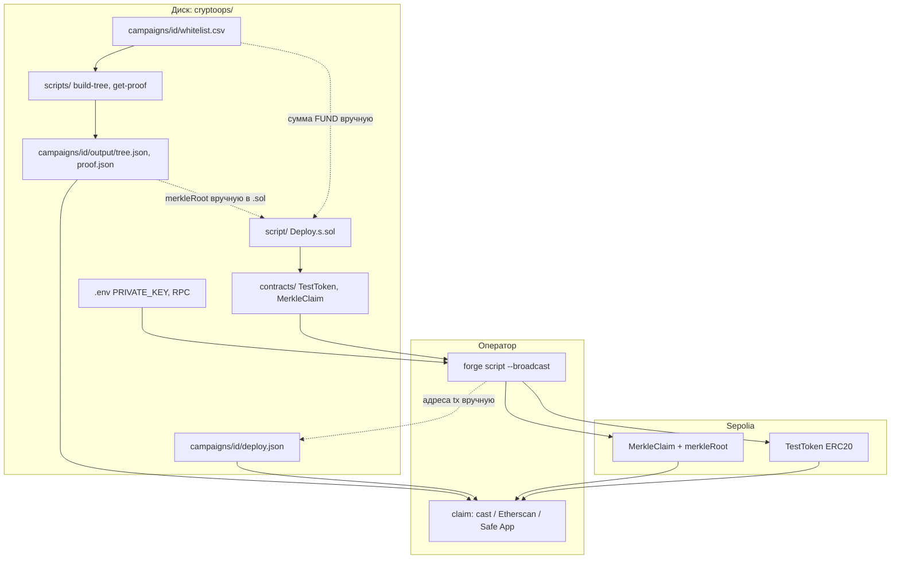

# CryptoOps — Merkle Airdrop (Sepolia)

Учебный end-to-end: **whitelist → Merkle (off-chain) → деплой ERC20 + MerkleClaim → claim**.

| Режим | Куда идти |
|-------|-----------|
| **Весь путь сразу** | [Playbook: шаг 0 → claim](#playbook-от-0-до-claim) (команды в этом файле) |
| **По частям / углубление** | [Карта документации](#карта-документации) → локальные README в подпапках |
| **Что с чем связано** | [Схема взаимодействия](#схема-взаимодействия-при-исполнении) |

Список завершённых кампаний: [`campaigns/README.md`](campaigns/README.md).

---

## Карта документации

| Документ | Папка / файл | Когда открывать |
|----------|----------------|-----------------|
| **Этот файл** | [`README.md`](README.md) | Playbook целиком, claim, verify, SLA, troubleshooting |
| Кампании | [`campaigns/README.md`](campaigns/README.md) | Сводка всех `<id>/`, новая папка, `active.json`; в папке кампании — только `deploy.json`, без README |
| Merkle (Node) | [`scripts/README.md`](scripts/README.md) | `npm run build-tree`, `get-proof`, `CAMPAIGN_ID` — **не** деплой |
| Деплой (Foundry) | [`script/README.md`](script/README.md) | `Deploy.s.sol`, `MERKLE_ROOT`, `FUND`, `forge script` — **токен + claim одной tx** |
| Foundry setup | [`FOUNDRY.md`](FOUNDRY.md) | Установка `forge`/`cast`, `foundry.toml`, RPC |
| Runbook (завершённые кампании) | [`RUNBOOK.md`](RUNBOOK.md) | 001–004: EOA claim, Safe claim, deploy-справка |
| Cursor (агент) | [`.cursor/README.md`](.cursor/README.md) | правила + `/new-campaign` и др. slash-команды |
| **DDS Dashboard** | [`dashboard/README.md`](dashboard/README.md) | Streamlit ДДС / балансы Sepolia (`streamlit run app.py`) |

> **Не путать:** `scripts/` (Node, Merkle на диске) и `script/` (Solidity, on-chain деплой).

---

## Схема взаимодействия (при исполнении)



Кратко по слоям:

| Шаг | Кто работает | Читает | Пишет |
|-----|--------------|--------|-------|
| 1–2 | Ops | `campaigns/<id>/` | `whitelist.csv` |
| 3–4 | Node (`scripts/`) | CSV + `CAMPAIGN_ID` | `output/tree.json`, `proof.json` |
| 5–6 | Foundry (`script/`) | root + fund из шага 4 + CSV | контракты на Sepolia |
| 7 | Ops | логи `forge` | `deploy.json` |
| 8–9 | Treasury / получатель | `proof.json`, `deploy.json` | claim tx on-chain |

`forge` **не читает** `tree.json` автоматически — root и fund копируются в константы `Deploy.s.sol` ([`script/README.md`](script/README.md)).

---

## Playbook: от 0 до claim

Один проход для **новой** кампании `campaigns/<your-id>/`. На каждом шаге — ссылка на локальный README с деталями.

### Шаг 0. Окружение (один раз)

```powershell
cd C:\Users\d_nik\pypro\cryptoops
copy .env.example .env
# PRIVATE_KEY, SEPOLIA_RPC_URL, ETHERSCAN_API_KEY
npm install
```

- Foundry: [`FOUNDRY.md`](FOUNDRY.md)
- PATH: `$env:Path += ";$env:USERPROFILE\.foundry\bin"`

Загрузка `.env` в PowerShell (для `cast`, если нужно):

```powershell
Get-Content .env | ForEach-Object {
  if ($_ -match '^\s*([^#][^=]+)=(.*)$') {
    Set-Item -Path "env:$($matches[1].Trim())" -Value $matches[2].Trim()
  }
}
```

### Шаг 1. Папка кампании + whitelist

→ детали: [`campaigns/README.md`](campaigns/README.md) § «Новая кампания»

```powershell
mkdir campaigns\my-campaign-sepolia-005
copy campaigns\_template\whitelist.example.csv campaigns\my-campaign-sepolia-005\whitelist.csv
copy campaigns\_template\deploy.example.json campaigns\my-campaign-sepolia-005\deploy.json
# отредактировать whitelist.csv: address, amount, decimals
```

Опционально: `campaigns/active.json` или только `$env:CAMPAIGN_ID` на шаге 2.

### Шаг 2. Merkle off-chain (Node)

→ детали: [`scripts/README.md`](scripts/README.md)

```powershell
$env:CAMPAIGN_ID = "my-campaign-sepolia-005"
npm run build-tree    # → campaigns/<id>/output/tree.json + root в консоли
npm run get-proof     # → campaigns/<id>/output/proof.json
```

Проверить: `proof.json` → `merkleRoot`; для каждого адреса есть `amount` и `proof`.

### Шаг 3. Подготовить деплой-скрипт (Foundry)

→ детали: [`script/README.md`](script/README.md)

Открыть [`script/Deploy.s.sol`](script/Deploy.s.sol) (или отдельный `Deploy*Safe.s.sol` для Safe) и **вручную** обновить:

| Константа | Откуда |
|-----------|--------|
| `MERKLE_ROOT` | `output/proof.json` → `merkleRoot` (или консоль `build-tree`) |
| `FUND_CLAIM_CONTRACT` | сумма всех `amount × 10^decimals` из `whitelist.csv` |
| `TOKEN_NAME` / `SYMBOL` / `DECIMALS` | по кампании |

Один `forge script` деплоит **сразу**: `TestToken` + `MerkleClaim` + `mint` на claim-контракт. Отдельного «только токен» нет.

### Шаг 4. Сборка и тесты

```powershell
forge build
forge test -vv
```

### Шаг 5. Деплой на Sepolia

```powershell
forge script script/Deploy.s.sol:Deploy --rpc-url sepolia --broadcast -vvvv
```

Из логов сохранить адреса **Token** и **MerkleClaim**.

### Шаг 6. Реестр `deploy.json`

Заполнить `campaigns/<id>/deploy.json` (шаблон: [`campaigns/_template/deploy.example.json`](campaigns/_template/deploy.example.json)): контракты, tx, `merkleRoot`, deployer.

### Шаг 7. Verify на Etherscan

→ ниже: [Верификация контракта](#верификация-контракта-на-etherscan)  
Нужен для **Write Contract** в браузере; claim через `cast` verify не требует.

### Шаг 8. Claim

Данные: `output/proof.json` → `claims[<address lowercase>]`; контракт: `deploy.json` → `merkleClaim.contract`.

| Получатель | Как |
|------------|-----|
| EOA (Rabby) | [Claim — три способа](#claim--три-способа-как-в-учебном-прогоне) ниже |
| Gnosis Safe | [`RUNBOOK.md`](RUNBOOK.md) § Safe 003–004 — Transaction Builder, не Etherscan + личный Rabby |

### Шаг 9. Post-flight

- `hasClaimed` / балансы ERC20 = ожиданиям  
- `deploy.json` обновлён (claim tx)  
- Чеклисты: [SLA и чеклисты](#sla-и-чеклисты-контекст-фонда--back-office)

---

## Архитектура (кратко)

```
campaigns/{id}/whitelist.csv
       │  npm run build-tree / get-proof  (scripts/)
       ▼
campaigns/{id}/output/tree.json, proof.json
       │  MERKLE_ROOT + FUND вручную → script/Deploy.s.sol
       ▼  forge script --broadcast
Sepolia: TestToken + MerkleClaim (+ mint на claim)
       │  записать адреса
campaigns/{id}/deploy.json
       │  claim (proof.json + deploy.json)
баланс токена у получателей
```

Активная кампания по умолчанию: [`campaigns/active.json`](campaigns/active.json) → `eftihia-sepolia-001` (переопределение: `$env:CAMPAIGN_ID`).

---

## Структура проекта

```
cryptoops/
├── README.md
├── RUNBOOK.md                   ← завершённые кампании 001–004 (EOA + Safe)
├── FOUNDRY.md
├── campaigns/
│   ├── active.json              ← кампания по умолчанию для npm scripts
│   ├── README.md
│   ├── _template/               ← шаблоны новой кампании
│   └── <campaign-id>/           ← данные кампании (README в папке не создаём)
│       ├── whitelist.csv
│       ├── output/tree.json, proof.json
│       └── deploy.json          ← on-chain реестр этой кампании
├── scripts/                     ← Node: build-tree, get-proof ([scripts/README.md](scripts/README.md))
├── script/                      ← Solidity: Deploy.s.sol ([script/README.md](script/README.md))
├── contracts/                   ← TestToken, MerkleClaim
├── test/
├── merkle-tree/                 ← npm dependency (OpenZeppelin)
├── foundry.toml
├── package.json
├── .env.example
└── .env
```

---

## Требования

- **Node.js** 18+ (`npm`)
- **Foundry** (`forge`, `cast`) — на Windows удобно через Git Bash: `foundryup`
- **Git** (для `forge install` / submodules)
- Кошелёк с **Sepolia ETH** (faucet)
- Опционально: [Etherscan API key](https://etherscan.io/apidashboard) (verify + не обязателен для деплоя)

### PATH для PowerShell

```powershell
$env:Path += ";$env:USERPROFILE\.foundry\bin"
```

---

## Справочник: деплой `eftihia-sepolia-001` (пример)

| Объект | Адрес |
|--------|--------|
| **Eftihia (ERC20)** | `0x8d271a6651405A052315f686703abDA6900F1389` |
| **MerkleClaim** | `0x313330E4a25b1F52Fa5f6De31bDE4F21FD917eA6` |
| **Merkle root** | `0xfde04f44bdb5e29ce3a74c3be1543223794d94e61805805e00d432d4030015b2` |
| **Deployer** | `0x6886654B5745EAbB1517eF9D8556c5b3dc86646f` |

- [Токен на Etherscan](https://sepolia.etherscan.io/address/0x8d271a6651405A052315f686703abDA6900F1389)
- [Claim на Etherscan (Write)](https://sepolia.etherscan.io/address/0x313330E4a25b1F52Fa5f6De31bDE4F21FD917eA6#writeContract)

**Сумма на claim:** `1800000000000` raw = **1 800 000** EFTIHIA (6 decimals).

---

## Claim — три способа (как в учебном прогоне)

### A. CLI (`cast`) — кошелёк с ключом в `.env`

```powershell
cast send 0x313330E4a25b1F52Fa5f6De31bDE4F21FD917eA6 `
  "claim(uint256,bytes32[])" `
  1800000000000 `
  "[0x1abc...,0xcfad...]" `
  --rpc-url $env:SEPOLIA_RPC_URL `
  --private-key $env:PRIVATE_KEY
```

`proof` — массив из `proof.json` для **этого** адреса (не адреса в массив, а хэши).

### B. Etherscan Write + Rabby

1. Rabby → нужный аккаунт → Sepolia.
2. [Write Contract](https://sepolia.etherscan.io/address/0x313330E4a25b1F52Fa5f6De31bDE4F21FD917eA6#writeContract) → **Connect to Web3**.
3. `claim(amount, proof)` → **Write** → подпись в Rabby.

Для `bytes32[] proof` с двумя элементами: кнопка **+** → `[0]` и `[1]`, либо JSON-массив в одном поле.

При смене кошелька в Rabby — **Connect заново** (после refresh страницы).

### C. Add token в Rabby (только отображение)

Token address = **ERC20** (`0x8d271a...`), не MerkleClaim.  
0 баланса до claim — нормально.

---

## Верификация контракта на Etherscan

**Зачем:** исходник на Etherscan → вкладки **Read Contract** / **Write Contract** (форма `claim` в браузере).  
**Не меняет** логику в блокчейне — только публикация кода.

### Через Foundry (рекомендуется)

1. Закодировать аргументы конструктора `MerkleClaim(owner, token, root)`:

```powershell
cast abi-encode "constructor(address,address,bytes32)" `
  0x6886654B5745EAbB1517eF9D8556c5b3dc86646f `
  0x8d271a6651405A052315f686703abDA6900F1389 `
  0xfde04f44bdb5e29ce3a74c3be1543223794d94e61805805e00d432d4030015b2
```

2. Verify:

```powershell
forge verify-contract 0x313330E4a25b1F52Fa5f6De31bDE4F21FD917eA6 `
  contracts/MerkleClaim.sol:MerkleClaim `
  --chain sepolia `
  --etherscan-api-key $env:ETHERSCAN_API_KEY `
  --constructor-args <ВЫВОД_cast_abi-encode> `
  --watch
```

Успех: `Pass - Verified`. Обновить `deploy.json` → `merkleClaim.verifiedOnEtherscan: true`.

### Опционально: verify TestToken

```powershell
cast abi-encode "constructor(address)" 0x6886654B5745EAbB1517eF9D8556c5b3dc86646f

forge verify-contract 0x8d271a6651405A052315f686703abDA6900F1389 `
  contracts/TestToken.sol:TestToken `
  --chain sepolia `
  --etherscan-api-key $env:ETHERSCAN_API_KEY `
  --constructor-args <encoded> `
  --watch
```

---

## `deploy.json` — справочник on-chain

Один файл на кампанию: `campaigns/{id}/deploy.json`.

Фиксирует контракты, tx, статус claim — для бэк-офиса и **Streamlit**.

Шаблон новой кампании: [`campaigns/_template/deploy.example.json`](campaigns/_template/deploy.example.json).

---

## SLA и чеклисты (контекст фонда / back office)

Ориентир для операции **«подготовить и исполнить Merkle claim»** (testnet или prod).  
Целевой продукт: **Streamlit app** поверх тех же шагов + `deploy.json` / `proof.json`.

### Роли (кто за что)

| Роль | Ответственность |
|------|-----------------|
| **Operations / Back office** | CSV, Merkle, сверки, статус claim, `deploy.json` |
| **Treasury / Custody** | Подпись tx с **кошелька фонда** (не личный Rabby) |
| **Compliance** | Eligibility, запрет личных кошельков, лимиты |
| **Tech / Dev** | Контракты, verify, RPC, скрипты |

### SLA — разумные ориентиры (внутренние)

| Этап | Целевое время | Примечание |
|------|---------------|------------|
| Whitelist frozen → `merkleRoot` + `proof.json` | **T+0** (в день snapshot) | Блокируется изменение CSV |
| Pre-flight checklist | **≤ 2 ч** после root | См. таблицу ниже |
| Deploy + fund claim contract | **T+0…T+1** | Зависит от custody |
| Etherscan verify | **≤ 24 ч** после deploy | Не блокирует claim, но нужен для ops UI |
| Claim batch (N кошельков) | **T+1…T+3** | Gas, очередь подписей |
| Post-reconciliation | **≤ 24 ч** после последнего claim | Балансы = ожиданиям |

Для **учебного Sepolia** сроки сжимаются до минут; для **фонда** добавьте окна под подпись custodian.

### Pre-flight (до любой on-chain tx)

| # | Проверка | Зачем | Кто |
|---|----------|--------|-----|
| 1 | CSV = финальный snapshot (версия, дата) | Иначе другой root | Ops |
| 2 | `merkleRoot` в `proof.json` = `Deploy.s.sol` / контракт | Invalid proof | Ops + Tech |
| 3 | Сумма `amount` raw = CSV × 10^decimals | Неверная выплата | Ops |
| 4 | `tree.json` сохранён и бэкап | Восстановить proof | Ops |
| 5 | Адреса checksum / lowercase keys в `proof.json` | Ошибки поиска proof | Ops |
| 6 | `Σ amounts` = баланс на claim-контракте после fund | Transfer failed | Treasury |
| 7 | Chain ID / RPC (Sepolia vs mainnet) | Неверная сеть | Tech |
| 8 | Подписант = адрес **из whitelist** | Claim только для eligible | Compliance |
| 9 | Gas / ETH на operational wallet | Stuck tx | Treasury |
| 10 | `.env` / ключи не в git | Security | Tech |

### Execution (claim)

| # | Проверка | Зачем |
|---|----------|--------|
| 1 | `hasClaimed(address)` = false | Уже claimed |
| 2 | proof из `proof.json` для **этого** address | Invalid proof |
| 3 | Подключён правильный кошелёк (Etherscan/Rabby) | Wrong sender |
| 4 | Tx success + Transfer event | On-chain подтверждение |
| 5 | Баланс ERC20 получателя += amount | Учёт |

### Post-flight (после кампании)

| # | Проверка | Зачем |
|---|----------|--------|
| 1 | Остаток на MerkleClaim ≈ 0 (или known dust) | Все забрали |
| 2 | `deploy.json` / реестр обновлён | Аудит trail |
| 3 | Tx hashes в учётной системе | NAV / operations |
| 4 | Повторный claim → revert `Already claimed` | Контроль double-spend |

### Идеи для Streamlit (следующий этап)

- Загрузка CSV → preview → `build-tree` / `get-proof`.
- Сравнение `merkleRoot` с `deploy.json` и on-chain `merkleRoot()` (read call).
- Таблица recipients: claimed / pending, ссылка Etherscan.
- Кнопка «copy cast command» per wallet.
- Чеклист pre-flight с галочками (SLA timer).
- Вторая кампания: `campaignId: eftihia-sepolia-002`, новые кошельки, новый `deploy.json`.

---

## Ещё одна кампания

Повторить [Playbook: от 0 до claim](#playbook-от-0-до-claim) с новым `campaigns/<id>/`.

Каждый деплой = **новые** адреса `TestToken` и `MerkleClaim`; старый контракт с другим root **нельзя** «дополнить» новым whitelist без нового деплоя.

История прогонов: [`campaigns/README.md`](campaigns/README.md).

---

## Безопасность

- **Никогда** не коммитить `.env` / private keys.
- `.env.example` — только заглушки.
- Testnet ключи — отдельные кошельки, не mainnet.
- В фонде: claim только на **custody-адреса** из policy.

---

## Troubleshooting

| Симптом | Решение |
|---------|---------|
| `PRIVATE_KEY` пустой в PowerShell | Загрузить `.env` (см. выше) или положить `.env` в корень для `forge` |
| RPC 404 | Сменить `SEPOLIA_RPC_URL` (напр. `https://ethereum-sepolia-rpc.publicnode.com`) |
| Invalid proof | Root / amount / proof не от этой кампании |
| Transfer failed | Недофонд на MerkleClaim |
| Already claimed | Повтор с того же адреса |
| Нет Write на Etherscan | `forge verify-contract` |
| `forge install` git error | `git init` в `cryptoops` |

---

## Полезные ссылки

- [OpenZeppelin merkle-tree](https://github.com/OpenZeppelin/merkle-tree)
- [Foundry Book](https://book.getfoundry.sh/)
- [Sepolia Etherscan](https://sepolia.etherscan.io)
